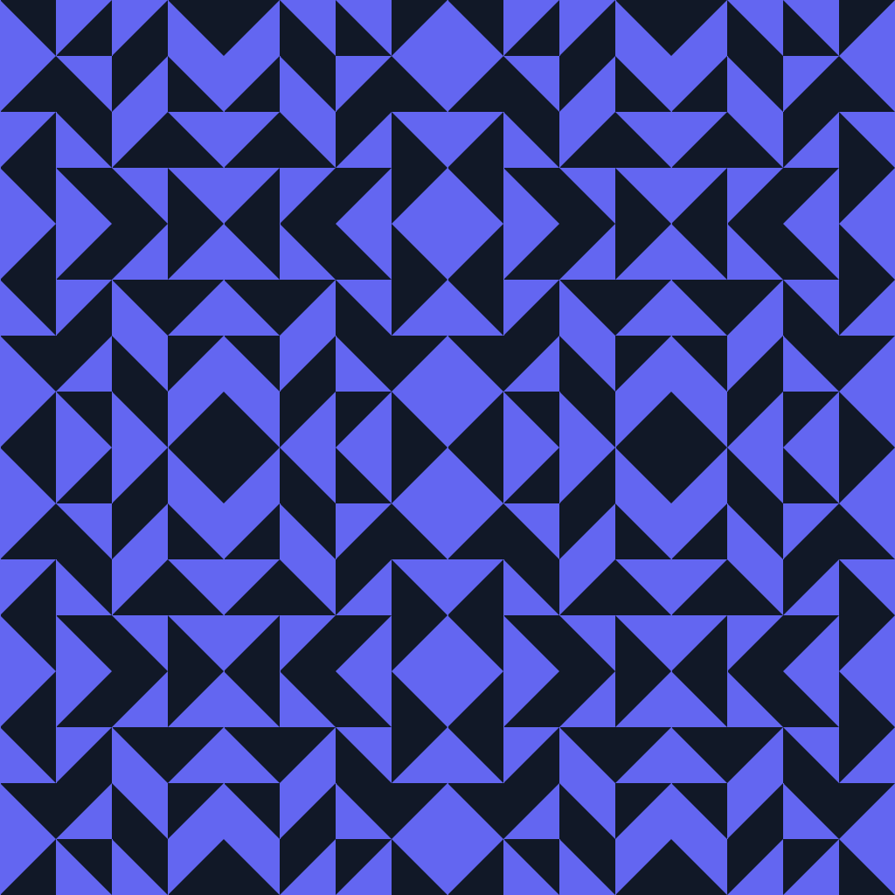

# Geometrix

[](https://github.com/phmatray/Geometrix/actions/workflows/dotnet.yml)
[](LICENSE)
[](https://github.com/phmatray/Geometrix/stargazers)
[](https://github.com/phmatray/Geometrix/issues)

**Geometrix** is a modern .NET 10 REST API for generating beautiful, customizable geometric patterns and abstract art. Create unique visual designs programmatically using mirror symmetry, cellular patterns, color themes, and seeded randomization — perfect for generative art, avatars, backgrounds, and creative applications.



## 🚀 Live Demo

Try the live API at: **[https://geometrix.garry-ai.cloud](https://geometrix.garry-ai.cloud)**

Explore the interactive Swagger documentation: **[https://geometrix.garry-ai.cloud/swagger](https://geometrix.garry-ai.cloud/swagger)**

## ✨ Features

- 🎨 **Customizable Patterns**: Control mirror power, cell size, colors, and more
- 🌈 **Color Themes**: Built-in color schemes or custom foreground/background colors
- 🎲 **Seeded Generation**: Reproducible patterns using seeds
- 💾 **Image Export**: Save generated images as PNG files
- 🔄 **RESTful API**: Simple HTTP endpoints for integration
- ⚡ **High Performance**: Built on .NET 10 with async/await
- 🐳 **Container Ready**: Kubernetes deployment included
- 📖 **OpenAPI/Swagger**: Interactive API documentation

## 🚀 Quick Start

### Generate an Image (cURL)

```bash
curl -X POST "https://geometrix.garry-ai.cloud/api/GenerateImage" \
  -H "Content-Type: application/json" \
  -d '{
    "mirrorPowerHorizontal": 4,
    "mirrorPowerVertical": 4,
    "cellGroupLength": 42,
    "cellWidthPixel": 8,
    "includeEmptyAndFill": true,
    "seed": 12345,
    "backgroundColor": "#1a1a2e",
    "foregroundColor": "#16213e"
  }' \
  --output pattern.png
```

### Generate with Color Theme

```bash
curl -X POST "https://geometrix.garry-ai.cloud/api/GenerateImage?theme=dark-indigo" \
  -H "Content-Type: application/json" \
  -d '{
    "mirrorPowerHorizontal": 2,
    "mirrorPowerVertical": 2,
    "cellGroupLength": 64,
    "cellWidthPixel": 16,
    "includeEmptyAndFill": false,
    "seed": 42
  }' \
  --output themed-pattern.png
```

## 🛠️ Tech Stack

- **.NET 10** - Latest C# and runtime features
- **ASP.NET Core** - High-performance web framework
- **.NET Aspire** - Cloud-native orchestration
- **SkiaSharp** - Cross-platform 2D graphics
- **Kubernetes** - Production deployment
- **GitHub Actions** - CI/CD pipeline

## 📦 Getting Started

### Prerequisites

- .NET 10.0 SDK or later ([Download](https://dotnet.microsoft.com/download/dotnet/10.0))
- A suitable IDE: [JetBrains Rider](https://www.jetbrains.com/rider/) or [Visual Studio 2025](https://visualstudio.microsoft.com/)

### Local Development

1. **Clone the repository**
   ```bash
   git clone https://github.com/phmatray/Geometrix.git
   cd Geometrix
   ```

2. **Restore dependencies**
   ```bash
   dotnet restore
   ```

3. **Build the project**
   ```bash
   dotnet build
   ```

4. **Run the API**
   ```bash
   dotnet run --project geometrix-api/Geometrix.WebApi/Geometrix.WebApi.csproj
   ```

5. **Access the API**
   - API: `http://localhost:5000`
   - Swagger UI: `http://localhost:5000/swagger`

## 📖 API Reference

### POST `/api/GenerateImage`

Generate a geometric pattern image.

**Parameters:**

| Parameter | Type | Required | Description |
|-----------|------|----------|-------------|
| `mirrorPowerHorizontal` | integer | Yes | Horizontal mirror symmetry (1-8) |
| `mirrorPowerVertical` | integer | Yes | Vertical mirror symmetry (1-8) |
| `cellGroupLength` | integer | Yes | Number of cells in the pattern grid |
| `cellWidthPixel` | integer | Yes | Size of each cell in pixels (4-32) |
| `includeEmptyAndFill` | boolean | Yes | Include empty and filled cells in pattern |
| `seed` | integer | Yes | Random seed for reproducibility |
| `backgroundColor` | string | No* | Hex color code (e.g., `#1a1a2e`) |
| `foregroundColor` | string | No* | Hex color code (e.g., `#16213e`) |

**Query Parameters:**
- `theme` (optional): Predefined color theme (e.g., `dark-indigo`, `ocean`, `sunset`)

*Colors are required unless using a theme.

**Response:** PNG image (binary)

**Example Response:**
```
Content-Type: image/png
Content-Length: 45234
[Binary PNG data]
```

For full API documentation, visit the [Swagger UI](https://geometrix.garry-ai.cloud/swagger) on the live instance.

## 🎨 Use Cases

- **Generative Art**: Create unique artwork programmatically
- **Avatar Generation**: Generate consistent user avatars from usernames/IDs
- **Background Patterns**: Dynamic website/app backgrounds
- **NFT Art**: Algorithmic art generation for digital collectibles
- **Design Inspiration**: Explore geometric pattern possibilities
- **Data Visualization**: Visual representation of numeric data

## 🤝 Contributing

Contributions are welcome! Please read [CONTRIBUTING.md](CONTRIBUTING.md) for details on our code of conduct and the process for submitting pull requests.

1. Fork the repository
2. Create your feature branch (`git checkout -b feature/AmazingFeature`)
3. Commit your changes (`git commit -m 'Add some AmazingFeature'`)
4. Push to the branch (`git push origin feature/AmazingFeature`)
5. Open a Pull Request

## 📄 License

This project is licensed under the MIT License - see the [LICENSE](LICENSE) file for details.

## 🙏 Acknowledgments

- Built with [.NET 10](https://dotnet.microsoft.com/)
- Graphics powered by [SkiaSharp](https://github.com/mono/SkiaSharp)
- Deployed on [Kubernetes](https://kubernetes.io/)

---

**Made with ❤️ by [Philippe Matray](https://github.com/phmatray)**
