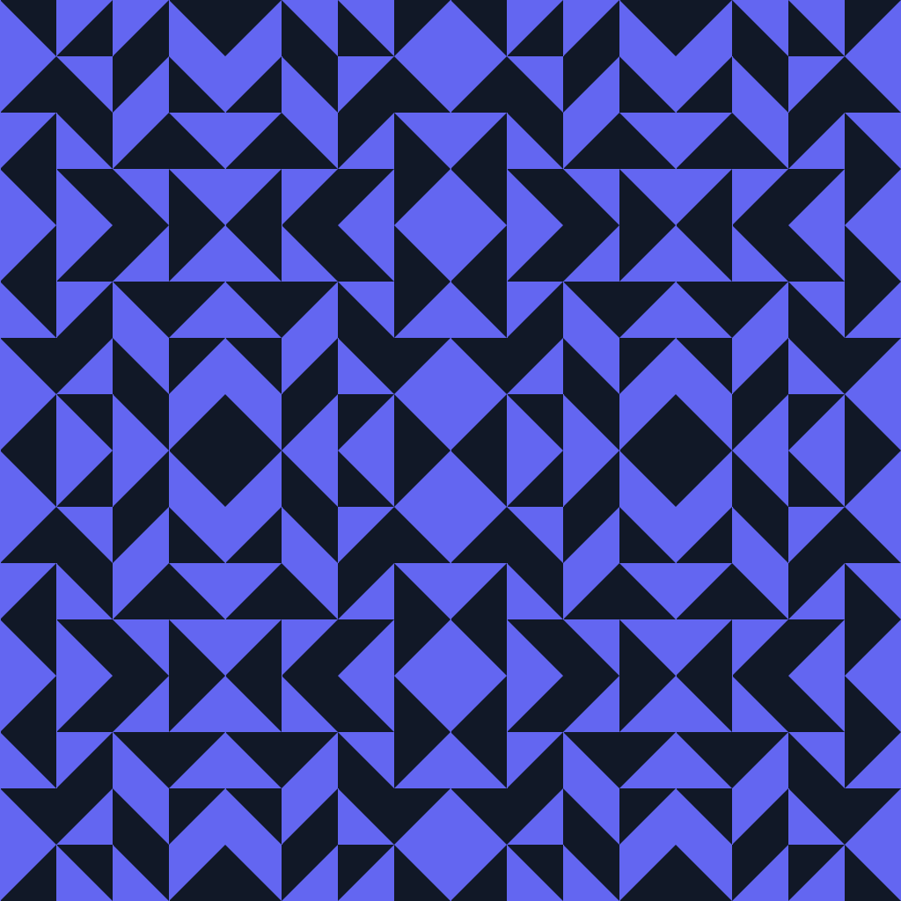

# Geometrix

[](https://github.com/phmatray/Geometrix/actions/workflows/dotnet.yml)
[](LICENSE)
[](https://github.com/phmatray/Geometrix/stargazers)
[](https://github.com/phmatray/Geometrix/issues)


**Geometrix** is a modern .NET 10 REST API for generating beautiful, customizable geometric patterns and abstract art. Create unique visual designs programmatically using mirror symmetry, cellular patterns, color themes, and seeded randomization — perfect for generative art, avatars, backgrounds, and creative applications.



---

## 🚀 Live Demo

Try the live API at: **[https://geometrix.garry-ai.cloud](https://geometrix.garry-ai.cloud)**

Explore Swagger: **[https://geometrix.garry-ai.cloud/swagger](https://geometrix.garry-ai.cloud/swagger)**

---

## ✨ Features

- 🎨 Customizable Patterns
- 🌈 Color Themes
- 🎲 Seeded Generation
- 💾 Image Export
- 🔄 RESTful API
- ⚡ High Performance
- 🐳 Docker support for easy deployment
- 📖 OpenAPI/Swagger

---

## 🚀 Quick Start

### 🐳 Run with Docker

```bash
docker run -p 8080:8080 phmatray/geometrix